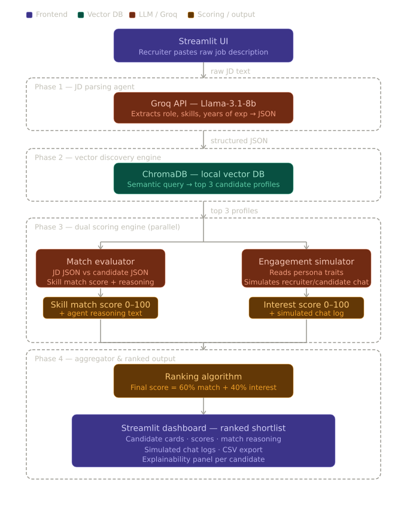

# ⚡ Catalyst AI: Autonomous Talent Sourcing & Engagement Pipeline

**A solo hackathon submission for Deccan AI Catalyst**

## 📖 Overview
Catalyst AI is an autonomous, end-to-end agentic workflow designed to eliminate the manual overhead of technical recruiting. It takes a raw Job Description as input, parses the core requirements, queries a local vector database of candidate profiles, and simulates a personalized outreach conversation to gauge genuine candidate interest. 

The final output is a ranked shortlist based on a composite score of **Skill Match (60%)** and **Interest Level (40%)**.

## 🏗 Architecture & Scoring Logic



The Catalyst AI pipeline operates on a deterministic, multi-agent architecture to ensure candidates are ranked not just by their resume, but by their likelihood to accept the role. 

**1. The Vector Retrieval (Pre-Screening):**
The parsed job requirements (Title + Skills) are converted into vector embeddings. ChromaDB searches the local candidate database and uses semantic similarity to pull the top 3 closest matches. 

**2. The Dual-Scoring Engine:**
Once the top 3 candidates are retrieved, the system forks into two parallel LLM evaluations using Groq (Llama-3.1-8b):
* **The Match Score (0-100):** The LLM acts as a strict technical recruiter, comparing the parsed JD JSON against the Candidate Profile JSON. It calculates a definitive score based on overlapping skills and experience, outputting a 2-sentence rationale for transparency.
* **The Interest Score (0-100):** The LLM acts as a conversational agent. It reads a hidden parameter in the candidate's database profile (`hidden_interest_level`) and simulates a 2-message outreach exchange. If the candidate's persona dictates they are happy at their current job, they reply dismissively, resulting in a low score. If they are actively looking, they reply enthusiastically, resulting in a high score.

**3. The Golden Ranking Formula:**
The final candidate ranking relies on a weighted algorithm: 
`Overall Score = (Match Score * 0.6) + (Interest Score * 0.4)`
*Rationale:* The Match Score is weighted heavier to ensure highly qualified but passive candidates still rank above highly interested but under-qualified candidates.

## ⚙️ Technical Stack
* **Frontend:** Streamlit (Chosen for rapid UI prototyping and state management).
* **LLM Engine:** Groq API / Llama-3.1-8b-instant (Chosen for sub-second inference speed and reliable JSON output).
* **Vector Database:** ChromaDB (Persistent local instance, utilizing Hugging Face sentence-transformers for fast, free embeddings).
* **Language:** Python 3.10+

## ⚖️ Trade-offs & Design Decisions
* **Local vs. Cloud Vector DB:** Opted for a persistent local ChromaDB instance rather than a managed cloud service to ensure zero latency during the demo and adhere strictly to free-tier constraints.
* **Simulated Outreach vs. Multi-Agent Framework:** Decided against using heavy multi-agent frameworks (like CrewAI/AutoGen) for the engagement simulator. Instead, I used chained LLM prompts with strict JSON schema enforcement via Groq. This reduced token overhead, eliminated infinite conversation loops, and drastically improved the pipeline's execution speed.

## 🚀 Run It Locally

### Prerequisites
* Python 3.10 or higher
* A free [Groq API Key](https://console.groq.com/keys)

### Setup Instructions
1. **Clone the repository:**
   ```bash
   git clone [https://github.com/hrspunia/catalyst-talent-agent.git](https://github.com/hrspunia/catalyst-talent-agent.git)
   cd catalyst-talent-agent